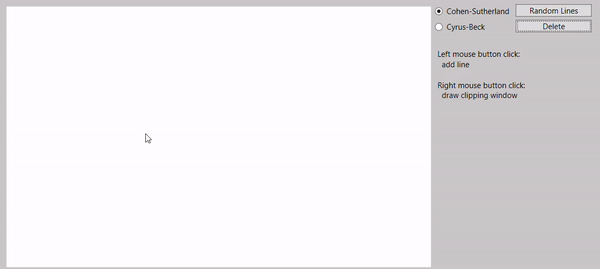

# Clipping

Clipping in computer graphics refers to the process of determining which portions of a graphical object
or scene should be displayed within a certain viewing region, such as a window or viewport. 
Clipping ensures that only the visible parts of objects are rendered, optimizing performance
and improving visual realism. 

The Cohen-Sutherland algorithm efficiently determines line segment visibility within rectangular windows
by partitioning the viewing area into regions based on endpoint codes. 
Meanwhile, the Cyrus-Beck algorithm employs vector operations and parametric equations for clipping convex polygon edges within convex windows,
identifying entry and exit points concerning the clipping boundaries. These algorithms streamline the display process for enhanced visual rendering.

